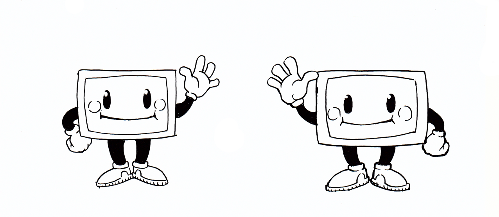
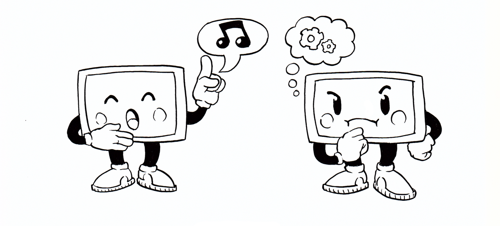
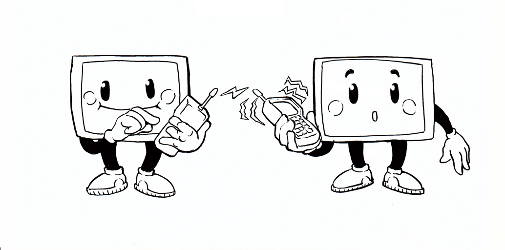
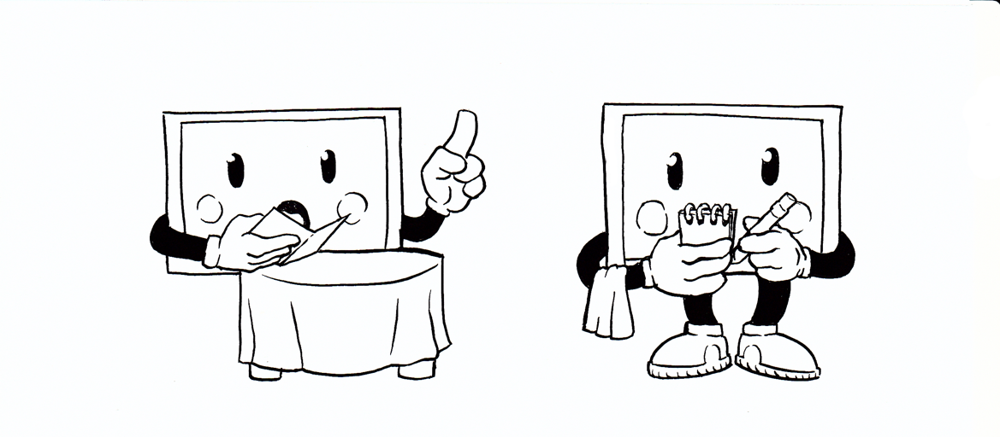
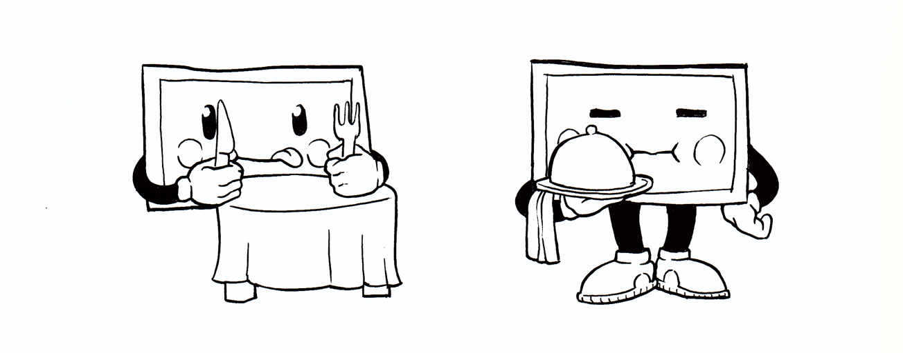
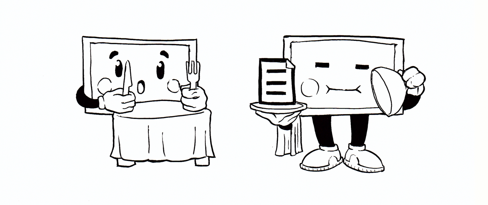
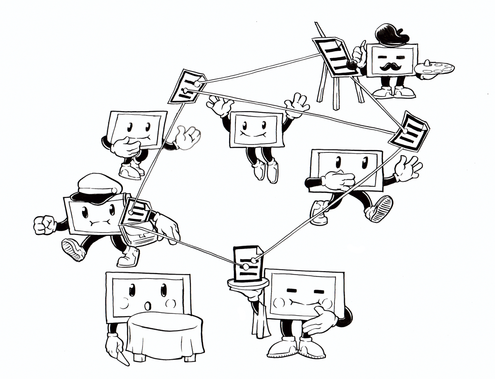

## Qu'est ce que le Web ?

Le *World Wide Web* est souvent confondu avec *Internet*, c'est tout à fait normal car **le Web fait partie d'Internet**. Mais qu'est-ce donc qu'Internet du coup ? En fait il s'agit d'un **réseau mondial** d'ordinateurs souhaitant communiquer entre eux.



Dans le monde des humains, nous avons établi différents *protocoles de communication* nous permettant de nous comprendre: la parole, la gestuelle, l'écriture, le dessin… Dans le monde des ordinateurs, c'est \*presque\* pareil.



Internet a défini énormément de protocoles différents (pour les mails, pour les transferts de fichiers, pour les vérifications d'identité des ordinateurs, etc). Dans le cas du Web, on utilise le **protocole HTTP** (pour **Hyper Text Transfer Protocol**).



Le protocole HTTP défini deux rôles distincts pour les ordinateurs : celui du **client** et celui du **serveur**. Il fonctionne en deux temps :



Premièrement, le client envoie une **requête** au serveur. Dans notre utilisation quotidienne, il s'agit de l'**adresse d'un site Web** que nous écrivons dans la barre d'adresse de notre **navigateur Web**. L'ordinateur que nous utilisons comprend alors qu'il agit comme client, et transfère la requête au serveur qui correspond à cette adresse.



Puis le serveur retourne une **réponse** au client. Cette réponse se fait généralement sous la forme d'une **page HTML**. Elle est interprétée par le navigateur Web pour afficher la page demandée.



## Comment écrire une page HTML

Une page HTML, c'est simplement un **fichier de texte** comme tu as déjà pu en lire beaucoup. Certains portent l'extension ".txt" ou  ".doc". Une page HTML de son côté porte l'extension ".html".

### Choisir un éditeur de texte

C'est pour ça qu'il te faudra un logiciel d'**édition de texte** : le bloc-note de Windows ferait parfaitement l'affaire par exemple. Par contre, tu ne peux pas utiliser un logiciel de *traitement de texte* comme Microsoft Word ou Libre Office. Il te permet de mettre en forme le texte que tu as écrit avec différentes polices, tailles de caractères, couleur et insertions d'images mais le format d'enregistrement ne correspondra pas aux normes HTML.

Dans ma présentation j'ai utilisé Atom[^1] qui présente toutes les fonctionnalités que les développeur.euse.s apprécient lorsqu'il.elle.s écrivent du code: auto-complétion, coloration syntaxique, indentation automatique, … Tu ne comprends peut-être pas ce que ces mots veulent dire pour le moment, mais crois-moi, après y avoir goûté, tu ne pourras plus t'en passer !


Les différents éditeurs sont organisés et ont des interfaces différences. C'est beaucoup au gout du développeur. Le mieux est d'en tester quelques uns et de choisir son préféré !

Editeurs alternatifs :
* Sublime text : [https://www.sublimetext.com/](https://notepad-plus-plus.org/)
* NotePad++ : [https://notepad-plus-plus.org/](https://notepad-plus-plus.org/)



[^1]: [Atom, un éditeur de texte multi-plateformes](https://atom.io/)
 
### HTML: Un langage structuré par des balises

Le HTML est un **langage de description de document** qui permet au navigateur de comprendre ce qu'il est en train de lire. Cela se fait en entourant le texte que l'on écrit de **balises**, qui sont composées d'une ou plusieurs lettres, entourée.s de chevrons.

Par exemple, pour que tout le monde soit bien au courant que nous sommes en train d'écrire une page HTML, on débute toujours par 2 balises :
 * `<!DOCTYPE html>` : déclarant l'utilisation du format HTML 5
 * `<html>` : déclarant le début de la page. On écrit la page, puis on referme avec la balise `</html>`, afin que l'on comprenne que la page est terminée.

```html
<!DOCTYPE html>
<html>
	<!-- Ma page HTML ici -->
</html>
```

**Mini-TP**: 

1. Copie/colle ce bout de code dans un éditeur de texte (par exemple : le bloc-note Windows)
2. Enregistre ton travail en le nommant par exemple "exemple.html". Tu peux remplacer "exemple" par le mot que tu veux, mais tu dois garder l'*extension* HTML.
3. Fais un clic droit sur le fichier enregistré, et choisit de l'ouvrir avec ton navigateur web (Google Chrome, Mozilla Firefox, Internet Explroer, Opera, etc.)
4. Que vois-tu ?[^11]

[^11]: Le texte "Ma page HTML ici" est affiché à l'écran, mais les balises sont masquées. 

### Communiquer avec les machines

J'ai dit qu'Internet était un réseau d'ordinateurs communiquant entre eux et que le Web était une sous-partie d'Internet. Cela veut dire que chaque page HTML doit être comprise par les ordinateurs qui les reçoivent.

L'**en-tête** est la partie que les navigateurs lisent pour comprendre quelle page le serveur leur a renvoyé. Il est de bon ton de donner un titre à sa page, que l'on intégrera dans la balise `<title>`:

```html
<!DOCTYPE html>
<html>
	<head>
		<title>Comment créer sa page HTML ?</title>
	</head>
<html>
```

Ma page s'est complexifiée, mais pas de panique, je t'explique tout : nous avons affaire à des **balises imbriquées**. Cela permet de définir une structure logique pour ma page HTML :

- J'ai écrit le titre de la page entre une balise ouvrante `<title>` et une balisse fermante `</title>` pour que le navigateur comprenne que "Comment créer sa page HTML ?" est le titre de ma page HTML.
- Ces balises sont imbriquées entre les balises `<head>` et `</head>`, qui indiquent au navigateur l'en-tête dont je t'ai parlé, qui est la partie de la page web qui lui est destinée.
- Ces balises `<head>` sont elles mêmes imbriquées entre les balises `<html>` qui définissent le début et la fin de ma page web.

On dit que la balise `<html>` est la **balise parente** de la balise `<head>`, qui est elle même parente de la balise `<title>`. Dans le sens inverse, la balise `<title>` est la **balise fille** de la balise `<head>` et ainsi de suite.

**Note :** Le format HTML ayant été inventé par des anglophones, tu te rendras vite compte que tous les noms des balises sont en anglais, comme "title" pour le titre, et "head" pour l'en-tête.


### Communiquer avec les humains

Le **corps** de ma page est la partie qui est destinée à être lue par les humains:

```html
<!DOCTYPE html>
<html>
	<head>
		<title>Comment créer sa page HTML?</title>
	</head>
	<body>
		<h1>Comment créer sa page HTML?</h1>
	</body>
</html>
```

On voit ici que les balises `<head>` et `<body>` se côtoient. On dit alors qu'elles sont **de même niveau**. C'est à dire qu'elle définissent deux parties distinctes de ma page. Comme je l'ai expliqué un peu plus haut, `<head>` est l'en-tête, destiné aux navigateurs web, tandis que `<body>` est le corps, destiné aux internautes.

La balise `<h1>`, imbriquée entre les balises `<body>`, contient le titre de ma page, identique à celui contenu dans ma balise `<title>`. L'un est destiné aux ordinateurs, l'autre aux humains.


Les balises h1 jusqu'à h6 permettent de créer des "titres". Et définissent des sections de contenu. Comme sur un document Word.



**Mini-TP:**

1. Copie/colle ce bout de page HTML dans ton éditeur de texte
2. Modifie le contenu de la balise `<title>` ou de la balise `<h1>` afin que les deux soit différents
3. Enregistre le fichier et ouvre le avec ton navigateur web
4. Que remarques-tu?[^12]

[^12]: Lorsque tu changes le contenu de la balise `<title>`, le titre dans l'onglet en haut de ton navigateur change. Lorsque tu modifies le contenu de la balise `<h1>`, c'est le texte affiché dans la fenêtre qui est modifié.

### La sémantique des balises

Nous avons pu entrevoir quelques balises, mais il en existe beaucoup plus ! Pourquoi avoir besoin de balises différentes ? Comme je l'ai dit, le HTML permet de structurer la page Web. La balise permet au navigateur de comprendre quelle genre d'information est transmise à l'utilisateur, car le navigateur ne comprend pas le langage des humains.

```html
<!DOCTYPE html>
<body>
	<h1>Comment créer sa page HTML?</h1>
	<p>Lorsque l'on écrit des page HTML, il est important de respecter l'imbrication des balises !</p>
	<p>Les paragraphes peuvent se succéder.</p>
</body>
```

Dans l'exemple ci-dessus, le corps de notre page contient un titre, inclus dans la balise `<h1>`, et un paragraphe, dans la balise `<p>`. C'est ce que l'on appelle la **sémantique** du HTML : à chaque balise son utilisation spécifique. 

Comme il y a énormément de balise, pour beaucoup de cas différents, il est utile de pouvoir se référer à une documentation lorsque l'on ne sait pas quelle balise serait la plus appropriée. La référence ultime dans le domaine est le Mozilla Developers Network[^2], très complet, traduits en français et toujours à la page. Si tu souhaites développer ton site internet, tu t'y référeras souvent.

[^2]: [La référence HTML du Mozilla Developers Network ( alias "La Bible du Web")](https://developer.mozilla.org/fr/docs/Web/HTML/Reference)


Le language HTML est codifié par un organisme nommé le W3 Consortium.



**Mini-TP:**

Dans l'exemple ci-dessus, je veux ajouter un titre pour le chapitre que je suis en train d'écrire: "Structure d'une page HTML", après le titre de la page, mais avant les deux paragraphes. Comment faire? (astuce: tu peux t'aider du [Mozilla Developers Network](https://developer.mozilla.org/fr/docs/Apprendre/HTML/Introduction_%C3%A0_HTML/HTML_text_fundamentals)) [^13]

[^13]: Il suffit d'insérer, entre les balises `<h1>` et `<p>`, une balise de titre de niveau 2 `<h2>Structure d'une page HTML</h2>`.

### Relier les pages entre elles avec des liens hypertextes

Une présentation du langage HTML ne peut pas se passer sans présentation des **liens hypertextes** (ou hyperliens, HTML signifiant *HyperText Markup Language*) !

En effet, lorsque nous naviguons sur le Web, nous n'entrons pas l'adresse URL de chaque page que nous souhaitons consulter dans la barre d'adresse du navigateur, ce serait fastidieux ! A la place, nous cliquons sur des liens hypertextes qui se chargent de nous diriger vers d'autres pages HTML. L'ensemble de toutes les pages interconnectées formant une sorte de "toile d'araignée mondiale" (N.D.L.R.: c'est la traduction de *World Wide Web* en français).



Un lien hypertexte se compose de deux parties distinctes : 
* sa **cible** : qui permet d'indiquer à l'internaute où ce lien est supposé l'envoyer
* son **libellé** : qui permet d'afficher le texte affiché pour l'internaut. Il s'agit du texte contenu dans une balise `<a>`:

```html
<a href="https://lesbricodeurs.fr">Un activitié proposée par Les Bricodeurs.</a>
```

L'on voit également que la balise `<a>` contient d'autres informations à l'intérieur des chevrons : il s'agit d'un **attribut HTML**. L'attribut `href` permet de préciser la **cible** du lien hypertexte. C'est l'adresse URL vers laquelle l'internaute sera redirigé.

Lorsque l'internaute clique sur un lien hypertexte dans son navigateur web, la **valeur** (la partie qui suit le symbole "=" et est entourée de guillemets) de l'attribut `href` est importé dans la barre d'adresse du navigateur, qui va effectuer une nouvelle requête HTTP à un serveur, qui lui renverra une autre page web.

## Mettre en forme le texte avec du CSS

Jusqu'à maintenant, je t'ai parlé de la manière de structurer l'information que tu veux communiquer à travers ta page HTML. Tu as pu observer que le navigateur affiche différemment les titres des paragraphes à partir du moment que l'on utilise les bonnes balises. Mais tu t'aperçois que les pages HTML que j'ai écrit ne ressemblent pas vraiment à celles que tu as l'habitude de consulter en naviguant sur le Web.

Comme les écrivains séparent le fond de la forme lorsqu'ils écrivent un roman, les développeurs web séparent le **contenu** du **style** d'une page Web. Le contenu, on l'a vu, est structuré dans la page HTML. Le style quant à lui, est défini dans une feuille de style CSS.

### Utiliser une feuille de style dans une page Web

Pour que le navigateur comprenne quels règles de style il doit utiliser, il faut lui expliquer où trouver la bonne feuille de style. Cela se fait en ajoutant une balise `<link>` dans l'en-tête de la page HTML. 

```html
<!DOCTYPE html>
<head>
	<title>Comment créer sa page HTML?</title>
	<link rel="stylesheet" href="style.css"/>
</head>
```

Cette balise te paraît étrange ? En effet, je n'ai pas besoin de la faire suivre d'une balise fermante, elle est **auto-fermante** (on dit aussi qu'il s'agit d'une * "balise orpheline"*). Ce qui nous intéresse ici ce n'est pas son contenu, mais bien ses deux attributs:

- `rel="stylesheet"` explicite au navigateur la nature de la ressource que l'on veut lier à la page HTML. Cela revient à dire: "Attention, je lie une feuille de style à ma page HTML."
- `href="style.css"` est l'adresse URL à laquelle se trouve la feuille de style en question. Je ne veux pas rentrer ici dans les détails de la résolution d'une adresse URL, mais sache juste que pour que ce code là fonctionne, il faut que la feuille de style s'appelle "style.css" et soit exactement dans le même dossier que la page HTML que je suis en train d'écrire.

### Anatomie d'une règle CSS

Si tu as fait la manipulation de ton côté, tu risques d'être un peu déçu: actuellement cette toute nouvelle feuille de style ne change absolument pas la page HTML dans ton navigateur. C'est toute à fait normal, car la feuille de style est vide ! Il faut donc inclure ce que l'on appelle des **règles CSS**.

Si, par exemple, je veux centrer le texte de ma page web, je vais écrire dans ma feuille de style:

```css
body {
  text-align: center;
}
```

Tout cela diffère radicalement de la manière d'écrire du HTML, ceci dit, tu dois quand même reconnaître un mot: "body". Et oui, cela désigne le *corps* de notre page HTML. En utilisant le nom de cette balise, je peux appliquer la règle suivante à tout le texte contenu dans la balise `<body>` de ma page web. Mais également à tout le texte contenu dans les *balises imbriquées* dans ma balise `<body>`, ainsi que les balises imbriquées dans ces balises, etc. On dit que les balises **héritent** des règles CSS de leur balises parentes.

Cette première partie, qui désigne l'élément HTML sur lequel appliquer ma règle CSS est appelé le **sélecteur**. La règle se compose de deux autres parties:

La **propriété** `text-align`, désigne ce que je veux modifier lors de l'affichage de ma page web, ici il s'agit de l'alignement du texte.

Après les symbole `:`, j'ai écrit la nouvelle **valeur** que je veux que prenne la propriété que j'ai choisi. Ici je décide d'utiliser `center` pour indiquer au navigateur de centrer le texte.

Les propriétés et les valeurs qu'elles peuvent prendre sont extrêmement nombreuses, et encore une fois, la documentation du Mozilla Developers Network[^3] te sera d'une aide précieuse !

[^3]: [La référence CSS du Mozilla Developers Network](https://developer.mozilla.org/fr/docs/Web/CSS)

**Note:** CSS signifie *Cascading StyleSheets*, ce qui se traduit par "feuilles de style en cascade". La "cascade" désigne ici cette faculté des règles CSS de se propager d'une balise aux balises imbriquées…

**Mini-TP:**

Pour que l'on voit bien mes titres, j'aimerais qu'il soient de couleur rouge. Quelle règle CSS devrais-je écrire dans ma feuille de style?[^14]

[^14]: `h1 { color: red; }`

## Le travail de l'intégrateur.trice Web

Le.la spécialiste des pages web bien structurées et agréable à l'oeil, s'appelle l'*intégrateur.trice web*. Sa connaissance des propriétés CSS et des balises HTML lui permet de coller au pixel prêt à la vision du.de la web designer.

Ce.tte web designer est chargée de produire une **maquette graphique** (souvent sous forme de fichier Photoshop) qu'il.elle donnera à l'intégrateur.trice , chargé.e de l'**implémentation** de cette maquette: transformer ce la.les image.s en page.s web fonctionnelle.s.

Ainsi, si je reçois la maquette suivante, récupérée sur le Blog du Web Design[^4], je commence à l'analyser:

[^4]: [Les maquettes gratuites publiées sur le Blog du Web Design](https://www.blogduwebdesign.com/psd/)


- Je m'aperçois qu'il y a trois parties qui sont situées côte à côte. Cela me fait penser à la propriété CSS `display`, qui me permet de choisir l'agencement visuel de mes éléments HTML.
- Il y a des boutons qui doivent probablement rediriger vers d'autres pages web, j'utiliserais des balises `<a>`.
- Les textes de ces boutons sont surlignés avec la couleur orange, je vais devoir changer leur propriété `background-color`…

Faire l'intégration complète de cette maquette correspondrait à une matinée de travail pour un.e intégrateur.trice, alors je ne vais pas te la montrer en direct, mais je pense que tu as compris le principe.

## Pour aller plus loin

Le texte de cet article commence à être un peu long, et j'aurais probablement besoin de dizaines d'autres articles si je devais t'expliquer tout ce qu'il y a a savoir sur l'intégration web. Fort heureusement, le web regorge justement de ressources pédagogiques pour apprendre à intégrer, designer et programmer de chez soi, et certains de nos bricodeurs ont décidé de commenter celles qui leur ont personnellement servi dans [un précédent article](). 

Si tu veux t'entraîner de chez toi, je peux te proposer un petit TP, que tu peux réaliser à ton rythme:

Il s'agit de faire la page Web du menu de ce que tu vas manger ce soir (ou de ce que tu as mangé la veille, comme tu préfères). La page devrait comporter:

- Un titre, autant pour le navigateur que pour l'internaute
- La date du jour
- Trois parties: entrée, plat et dessert
- (optionnel) Plusieurs choix pour les entrées, plats et desserts
- (optionnel) Un lien vers la recette de chaque plat, sur un site comme marmiton
- (optionnel) Une image pour chaque plat, histoire de mettre l'eau à la bouche de tes convives.
- (optionnel) Le prix affiché à côté des plats, car c'est en fait la carte d'un restaurant !
- (optionnel) L'adresse pour venir déguster ce bon repas avec toi.

Tu peux décorer ce menu comme tu le souhaites, mais voici quelques idées:

- Centrer les titres
- Une texture de papier en fond
- Une police de caractère classe pour les titres
- Une bordure autour des images
- Mettre les choix des plats côte à côte

Alternativement, tu peux aussi réaliser ton CV version HTML/CSS.

Si tu veux partager ta création, tu peux la réaliser à l'aide de l'éditeur de texte en ligne [codepen.io](https://codepen.io/). L'avantage est que ton code sera hébergé sur le web, et donc tu pourras nous demander de te donner des conseils dessus, en rejoignant le [slack](https://join.slack.com/t/bricodeurs/shared_invite/zt-3sxsf81w-Rvwn~LcyLi1ekAln6qCl1Q) des Bricodeurs et te rendant dans le canal #apprendre-a-coder-en-ligne.
