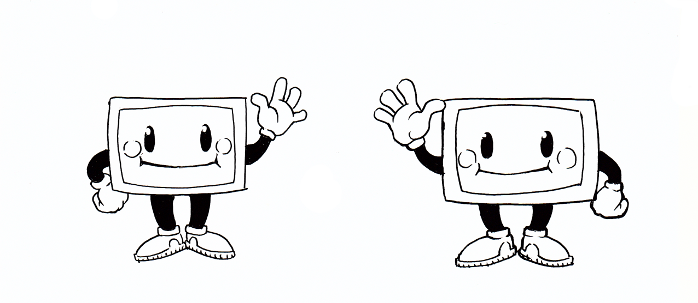
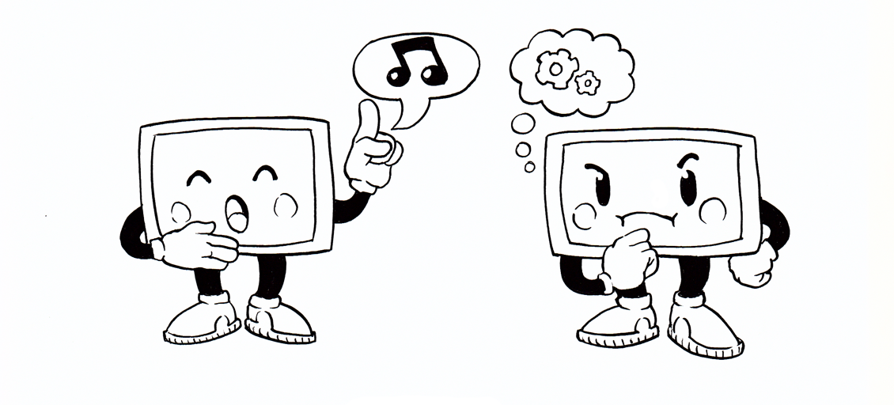
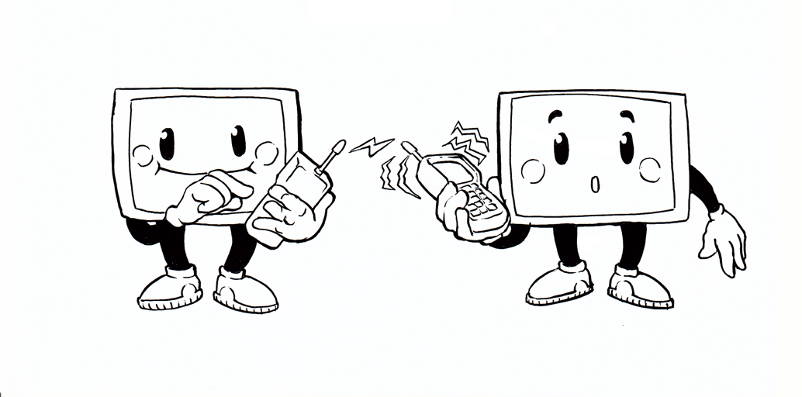
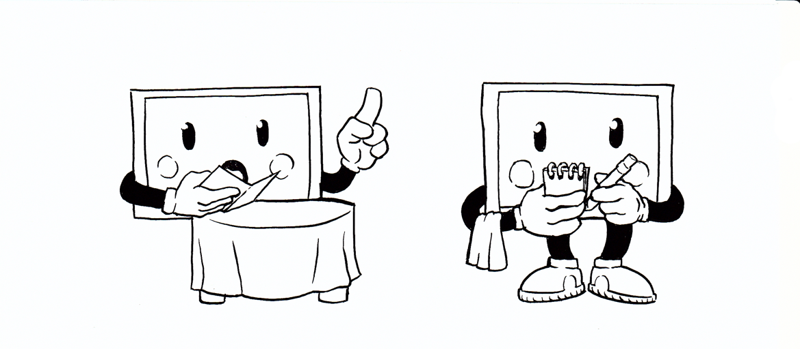
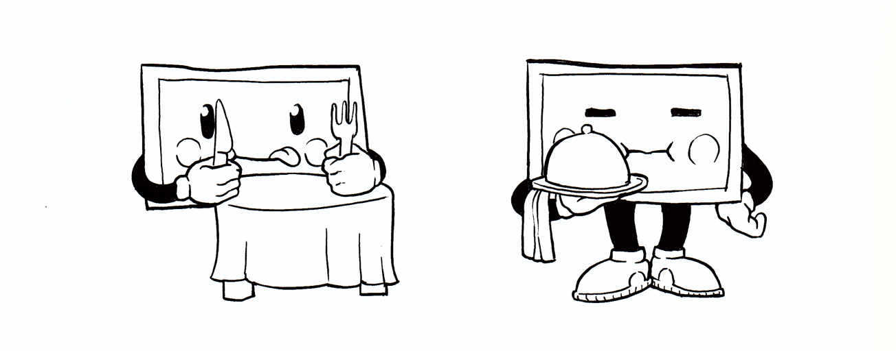

# Crée ta première page web!

## Qu'est ce que le Web?

Le *World Wide Web* est souvent confondu avec *Internet*, c'est tout à fait normal car **le Web fait partie d'Internet**. Mais qu'est-ce donc qu'Internet du coup? En fait il s'agit d'un **réseau mondial** d'ordinateurs souhaitant communiquer entre eux.

Dans le monde des humains, nous avons établi différents *protocoles de communication* nous permettant de nous comprendre: la parole, la gestuelle, l'écriture, le dessin... Dans le monde des ordinateurs, c'est \*presque\* pareil.

Internet a défini énormément de protocoles différents (pour les mails, pour les transferts de fichiers, pour les vérifications d'identité des ordinateurs,etc.). Dans le cas du Web, on utilise le *protocole HTTP* (pour *Hyper Text Transfer Protocol*).

Le protocole HTTP défini deux rôles distincts pour les ordinateurs: celui du **client** et celui du **serveur**. Il fonctionne en deux temps:

Premièrement, le client envoie une **requête** au serveur. Dans notre utilisation quotidienne, il s'agit l'**adresse URL** que nous écrivons dans la fenêtre de notre **navigateur Web**. L'ordinateur que nous utilisons comprend alors qu'il agit comme client, et transfère la requête au serveur qui correspond à cette adresse.

Puis le serveur retourne une **réponse** au client. Cette réponse se fait généralement sous la forme d'un **page HTML**, qui est un format de document que les navigateurs web peuvent facilement interpréter et afficher à nos écrans.

## Comment écrire une page HTML

### Choisir un éditeur de texte

### HTML: Un langage structuré par des balises

### Communiquer avec les machines, communiquer avec les humains

### La sémantique des balises

### Relier les pages entre elles avec des liens hypertextes

## Mettre en forme le texte avec du CSS

### Utiliser une feuille de style dans une page Web

### Anatomie d'une règle CSS

### Le travail de l'intégrateur Web

## Apprendre le Web... sur le Web!